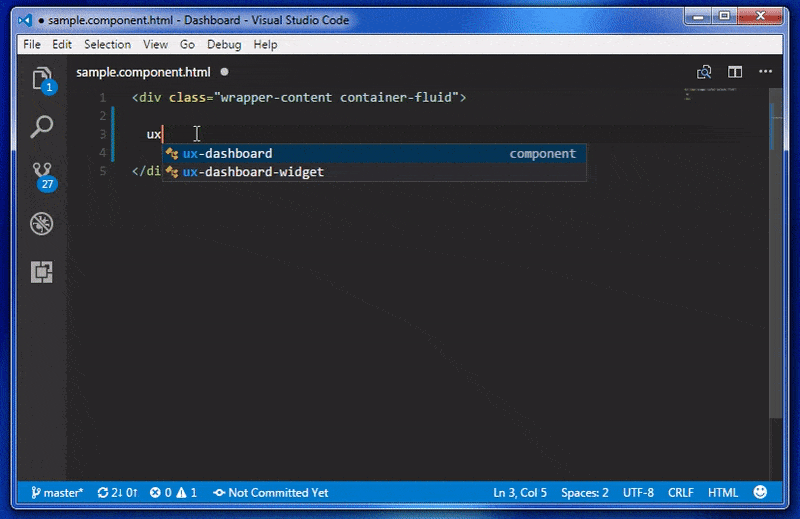
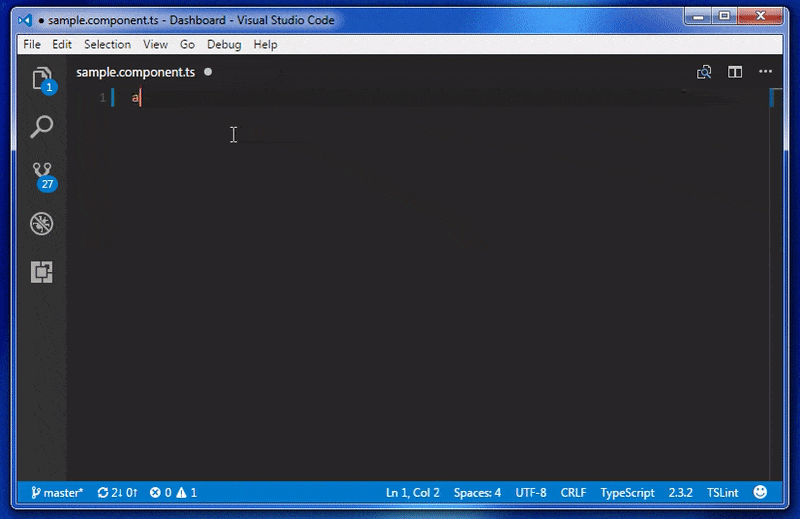
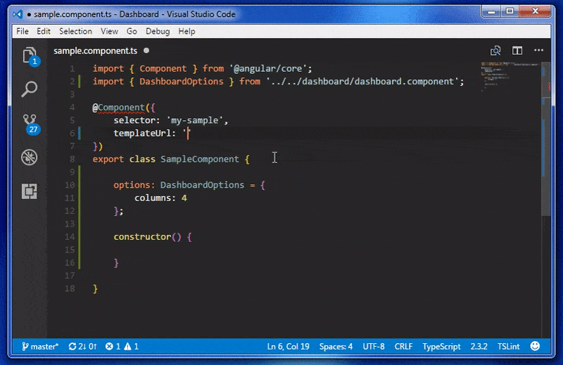
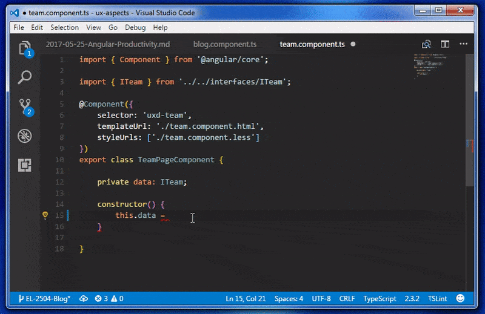

If you have started working with Angular and TypeScript one of the first things you notice is how much the tooling has improved when compared to writing apps in AngularJS and plain JavaScript. It brings many benefits such as early error detection, scalability and a productivity boost. With Type Definitions for nearly all major third party libraries the editor is now able to prompt you with contextually aware suggestions and often documentation on that function without leaving the editor. You get all these features as standard in editors such as VS Code, but there are many extensions available for the most popular editors that can further improve productivity and developer experience using Angular.

### 1. Angular Language Service

The Angular Language Service is an extension being developed by the Angular team and provides some incredibly useful features. The extension is aware of when you are working in a component template file and will provide you with auto complete suggestions, error checking and the ability to Ctrl+Click on a component, variable or function and jump to the implementation or declaration. It is also aware what component selectors are available and all of the inputs and outputs available on each element.

 

 
 

### 2. Angular v4 TypeScript Snippets

When creating an Angular application you will notice that are certain bits of code that you end up typing over and over again, in particular things like NgModule, Component and Directive decorators. To speed up this process the Angular v4 TypeScript Snippets extension allows you to easily create this boilerplate code for you.

 

 
 

### 3. Path Intellisense

One thing that becomes very common when creating Angular components is having to provide relative file paths for templates and stylesheets, but this also is common when adding images in HTML and CSS rules as well.

With the Path Intellisense plugin, the editor will display the list of files and folders in the directory and will update to show the appropriate results as you change the file path.

 

 
 

### 4. TSLint

TSLint is both an extension for your editor and a node module. It allows you to define a set of rules about how developers should write their code, making it consistent throughout the entire codebase. The editor extension will check your code as you type it, and inform you of anything that doesn't conform to the rules and the editor can often provide you with auto-fix functionality. TSLint can run as part of a build process to ensure that code meets the expected standard before the build will be successful.

In addition to this, you can add further rules describing how Angular components should be written by adding Codealyzer to your project.

 

 
 