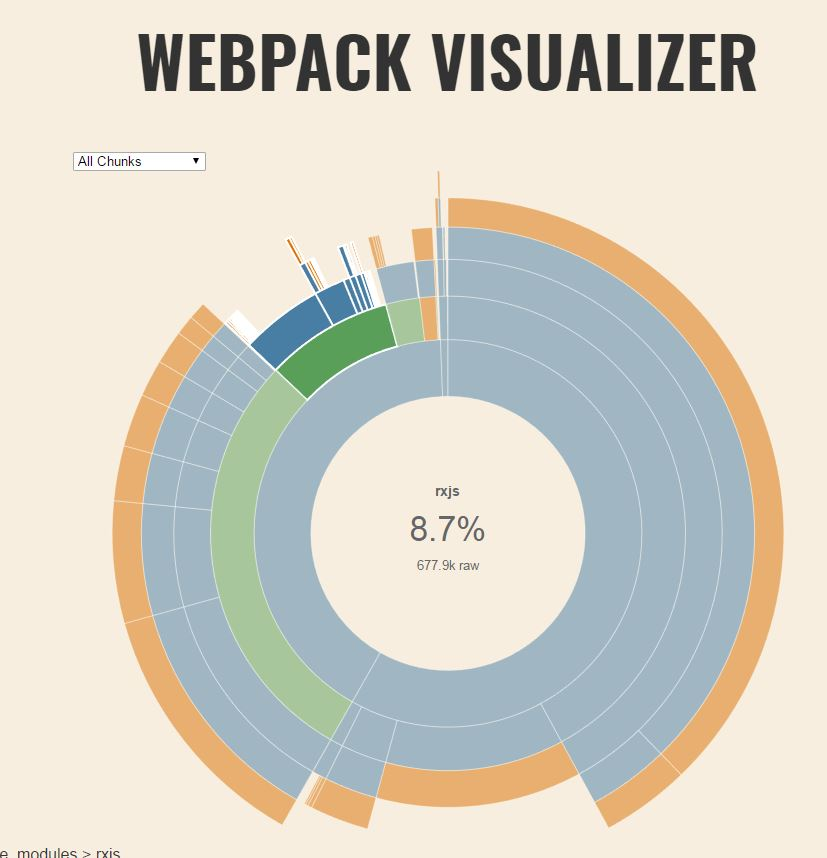
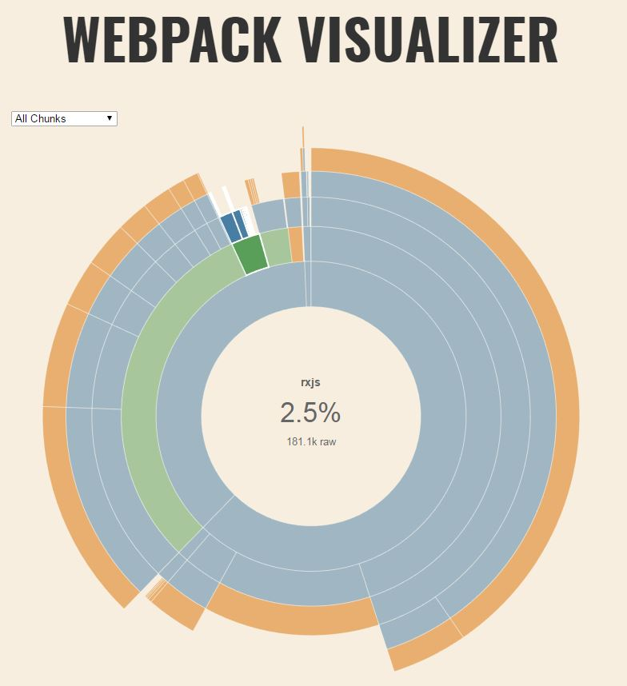
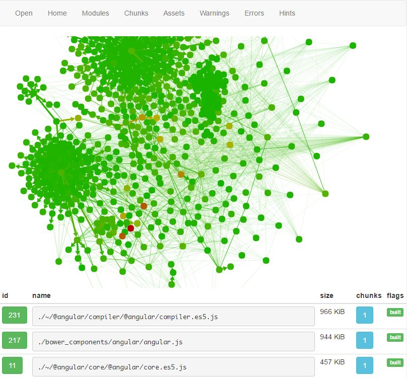

When building any large web application nowadays it is highly likely that you will use a bundling tool. Tools like Webpack bring some great benefits and optimizations such as Tree Shaking to remove any code that isn't used and code splitting to intelligently split code into different scripts so they can be lazy loaded only when they are needed, improving your page load times. Angular's router works extremely well with code splitting and can handle all the lazy loading for you.

It is commonplace in JavaScript to use many libraries and frameworks in your application and the size of your bundle can grow quite quickly. It can be difficult to easily identify what your bundle actually contains and determine what libraries are increasing the output size.

To help with this Webpack gives us a few useful tools. First we can output all the information about our Webpack build by passing the `--json` flag and streaming the output to a file. This can be done by using the following code:

<br>

```
webpack --json > stats.json
```

<br>


Next we can go to [https://chrisbateman.github.io/webpack-visualizer/](https://chrisbateman.github.io/webpack-visualizer/) which is an online tool to visualize the contents of your bundle. Simply select the JSON file we just created and it will show you the contents of your bundle with more detail once you hover over a segment. *Note, if nothing happens when you choose the file, ensure that the stats.json file contains valid JSON as some loaders print output which can cause problems.*

<br>



<br>

In the example image above you can see we have imported the entire RxJS library, adding 677.9KB to our build output. By importing only the things we need from the RxJS library we can take advantage of Tree Shaking. After we make the optimizations we can clearly see the difference.

<br>



<br>

Additionally Webpack offers its own online tool for analyzing bundles in more depth. This service can be found at [http://webpack.github.io/analyse/](http://webpack.github.io/analyse/).

<br>


