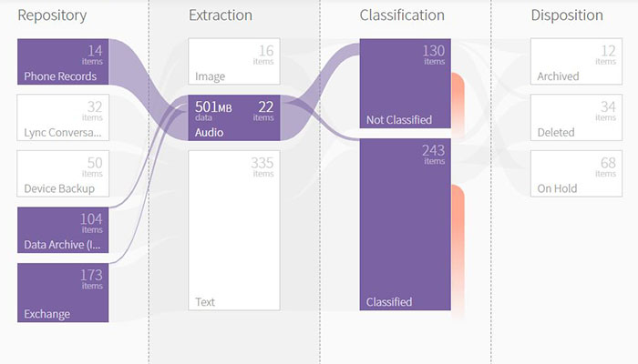
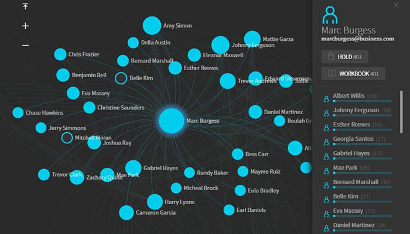

When working with big data we quickly find ourselves with large volumes of data which holds key information. In order to make use of this data we need a way to analyse and present it in a way that allows us to make critical decisions. Using charts and graphs to visualize this data provides a quick and easy way to understand the data and can be used to highlight areas that need attention, identify key trends and predict how things will change in the future.

It is important to remember that not all data should be visualized in the same way. In many cases what works for one data set will not accurately convey the information for another data set. For this reason UX Aspects provides a range of different visualization tools in the [charts section](https://uxaspects.github.io/UXAspects/#/charts/bar-charts). 

These cover simple bar charts, line charts and donut charts as well as some more specific charts such as the partition map, which is useful for displaying files in a repository, the organization chart, used for displaying the hierarchy of your organization, and the social chart for displaying social interactions between users. 

    
    

UX Aspects also provides a [color service](https://uxaspects.github.io/UXAspects/#/components/utilities#color-service) which allows you to quickly and easily update the colors on your charts to give your application that personal touch.

This is just a small overview of some of the data visualization tools UX Aspects offers to help you get the most out of your data, check out our documentation sections to preview these components in action and find out how to use them in your own application.